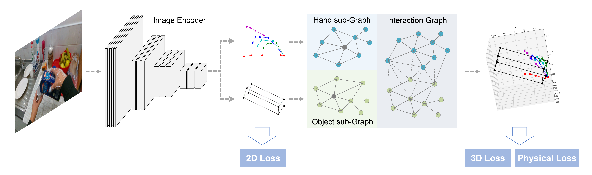
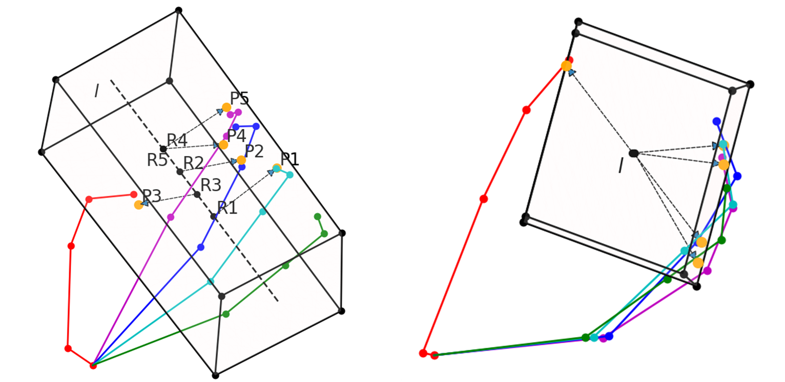

# Joint Hand-Object Pose Estimation with Differentiably-Learned Physical Contact Point Analysis

Codes for [**Hand-Object Pose Estimation paper**](https://arxiv.org/pdf/2004.00060.pdf) (ICMR 2021), a Contextual Graph Convolutional model for Hand-Object Pose Estimation.

The goal of Hand-Object Pose Estimation is to jointly estimate the poses of both the hand and a handled object. Our model can estimate the 2D and 3D hand and object poses and enhance the physical stability of hand-object system.
<div align="center">
    
</div>

## Architecture
The model starts with ResNet as the image encoder and for predicting the initial 2D coordinates
of the joints and object vertices. The coordinates concatenated with the image features used as the features of the input graph of a 3 layered graph convolution to use the power of neighbors features to estimate the better 2D pose. Finally the 2D coordinates predicted in the previous step are passed to our context-aware graph module to find the 3D coordinates of the hand and object.
<div align="center">
    
</div>

A physical affinity loss is proposed to enhance the stability of grasping as well.
<div align="center">
    
</div>

## Datasets
To use the datasets used in the paper download [**First-Person Hand Action Dataset**](https://guiggh.github.io/publications/first-person-hands/) and update the root path in the `make_data.py` file located in each folder and run the `make_data.py` files to generate the `.npy` files.

## Test Pretrained Model
First download [**First-Person Hand Action Dataset**](https://guiggh.github.io/publications/first-person-hands/) and make the `.npy` files. Then download and extract the pretrained model and put it in the ```checkpoints``` folder.
```
link：https://pan.baidu.com/s/1NeJt64mG4o6ZbZ1Bzueylg 
password：wqbv
```
And then run the model using the pretrained weights.
```shell
python main.py \
  --input_file ./datasets/fhad/ \
  --test \
  --batch_size 64 \
  --model_def ContextNet \
  --gpu \
  --gpu_number 0 \
  --pretrained_model ./checkpoints/fhad_best_epoch.pkl
```
If you think this work helps you, please cite our paper:
```
@inproceedings{JHOPE,
  author    = {Nan Zhuang and
               Yadong Mu},
  title     = {Joint Hand-Object Pose Estimation with Differentiably-Learned Physical
               Contact Point Analysis},
  booktitle = {{ICMR} '21: International Conference on Multimedia Retrieval, Taipei,
               Taiwan, August 21-24, 2021},
  pages     = {420--428},
  publisher = {{ACM}},
  year      = {2021}
}
```
